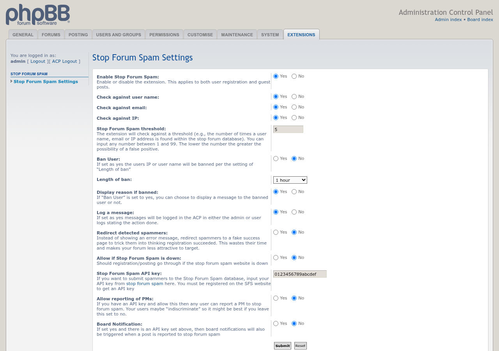
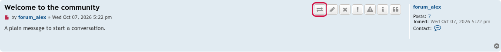

# Stop Forum Spam

 

Checks registrations and guest posts against the Stop Forum Spam database and lets staff report spammers to it.

## Features

- Checks the username, email address and IP address of new registrations, and of guest posts and guest messages sent through phpBB's contact form, against [Stop Forum Spam](https://www.stopforumspam.com/). Each check can be switched on or off, and you set how many database hits count as spam.
- Detected spammers can be shown an error, or sent to a fake success page so they think it worked. Optionally bans them and logs the block in the ACP.
- Choose whether registration and posting go through when Stop Forum Spam can't be reached.
- With a Stop Forum Spam API key, administrators and moderators get a button to report a post's author, and users can optionally report private messages they received. Reports can raise a board notification.
- Works with [Contact Admin](https://github.com/phpbbmodders/contactadmin): its contact form is checked too.
- Settings under **ACP → Extensions → Stop Forum Spam**.

## Screenshots

<table>
  <tr>
    <td align="center"> ACP settings</td>
    <td align="center"> The report button moderators see on posts (outlined)</td>
  </tr>
</table>

Click a screenshot for the full size. They are also on the [Screenshots wiki page](https://github.com/phpbbmodders/stopforumspam/wiki/Screenshots).

## Requirements

- phpBB 3.3.19 or later
- PHP 7.4 or later, with the cURL extension built with SSL support

## Installation

1. Copy the extension to `/ext/phpbbmodders/stopforumspam`
2. In the Administration Control Panel, go to **Customise → Manage extensions**
3. Enable the **Stop Forum Spam** extension
4. Choose the settings under **ACP → Extensions → Stop Forum Spam**

### Upgrading from `rmcgirr83/stopforumspam`

This extension used to be installed as `rmcgirr83/stopforumspam`. Your settings and reported-post history carry over:

1. If [SFS Companion](https://github.com/phpbbmodders/sfscompanion) is installed, disable it first (see its README for the full order).
2. Disable the old **Stop Forum Spam** extension in the ACP. Do **not** delete its data.
3. Upload this version to `/ext/phpbbmodders/stopforumspam` and enable it. The old install's migration history and ACP module are moved to the new name automatically.
4. Delete the `/ext/rmcgirr83/stopforumspam` folder and purge the board cache.

Update SFS Companion and Contact Admin as well. SFS Companion needs the new name to enable, and the Contact Admin integration only works when both extensions use the `phpbbmodders` name.

If you disable the old extension from the command line (`bin/phpbbcli.php`) instead of the ACP, run `bin/phpbbcli.php cache:purge` before enabling the new one; the command-line disable doesn't clear the cache.

## TODO

Ideas not yet built, practical and speculative alike: [`docs/TODO.md`](docs/TODO.md).

## Contributing

Contributions are welcome!

- **Bug reports**: [Open an issue](https://github.com/phpbbmodders/stopforumspam/issues).
- **Everything else** (questions, feature requests, ideas, general discussion): [Use Discussions](https://github.com/orgs/phpbbmodders/discussions), or the [community forum](https://www.phpbbmodders.com/community/).
- Pull requests are welcome for bug fixes or discussed features.

## Acknowledgments

- Original extension by Rich McGirr ([RMcGirr83](https://github.com/rmcgirr83)).
- Code review, bug fixes, and documentation assisted by [Claude](https://www.anthropic.com/claude).

## License

This extension is licensed under the **GNU General Public License v2.0**.

See [license.txt](license.txt) for more information.
